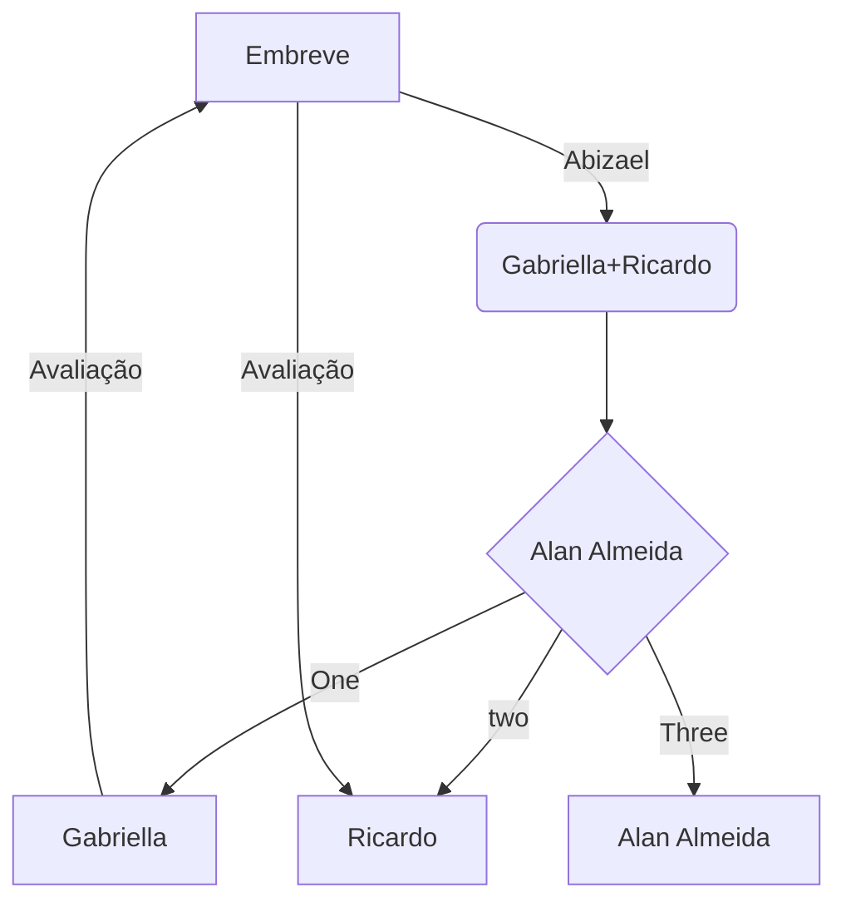

```mermaid
graph TD
A[Abril] -->|Abizael| B(Gabriella+Ricardo)
B --> C{Alan  Almeida}
C --> |One| D[Gabriella]
C --> |two| E[Ricardo]
C --> |Three| F[Alan  Almeida]
D --> |Avaliação| A[Embreve]
A --> |Avaliação| E[Ricardo]
```
